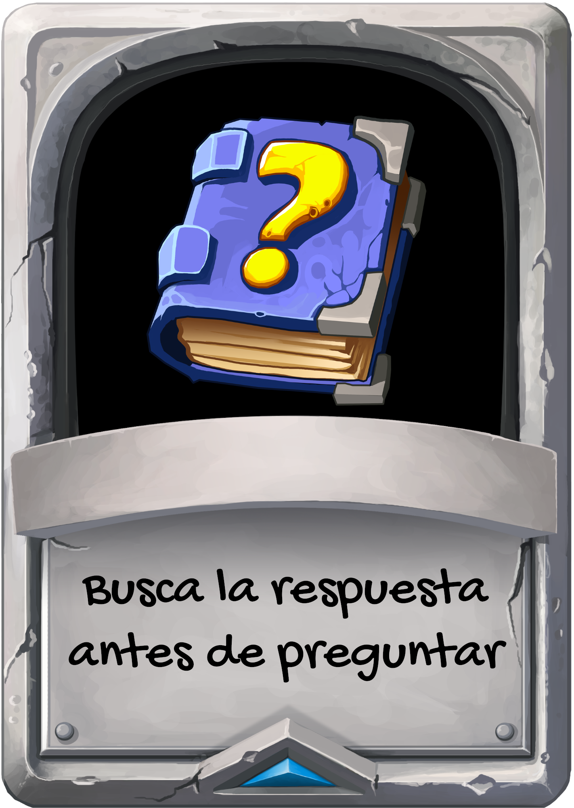

# Normas de conducta

## **No alimentes al trol.** Porque sin alimento se aburre y se va a otro sitio.

----

## **Antes de preguntar algo busca la respuesta por ti mismo.** Porque el tiempo de los demás es tan valioso como el tuyo.

-----

## **Deja todas tus identidades en la puerta.** Porque en internet nadie sabe que eres un caballero de ni. (No importa)
